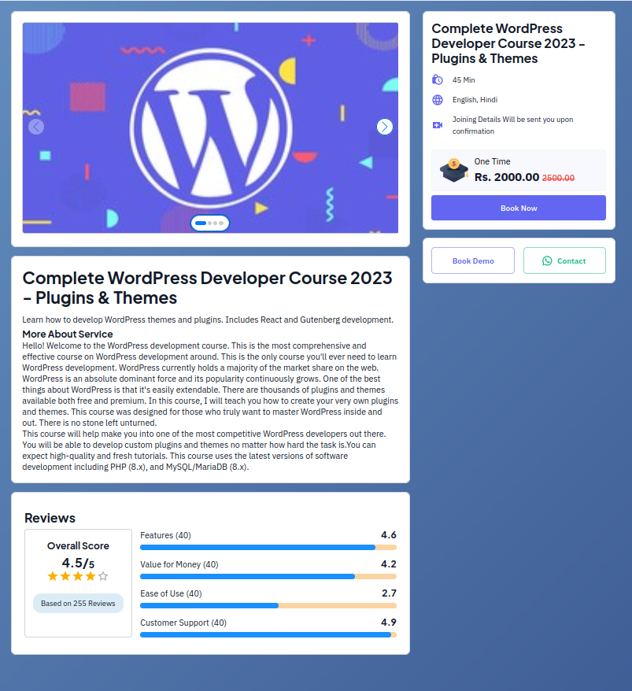
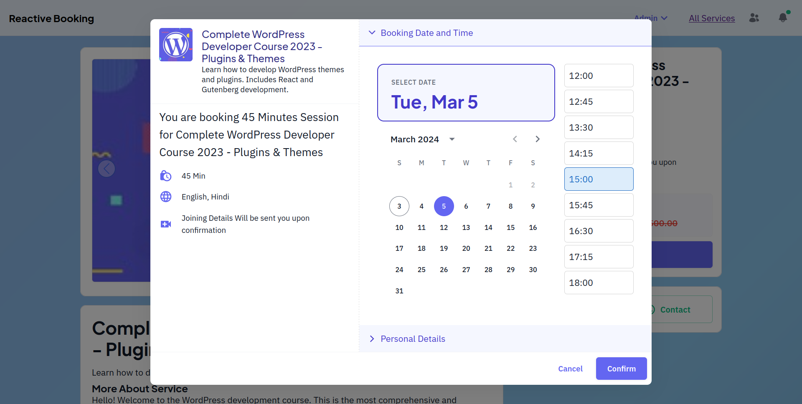
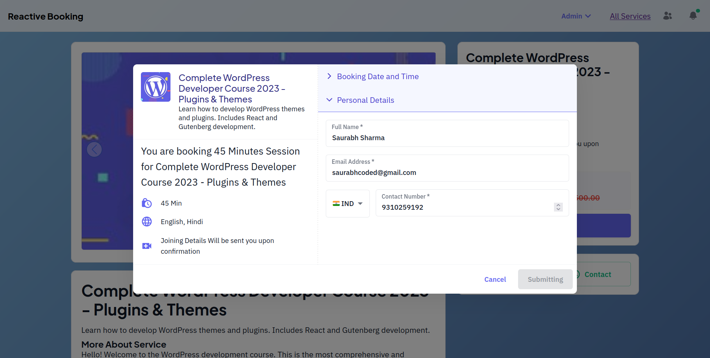
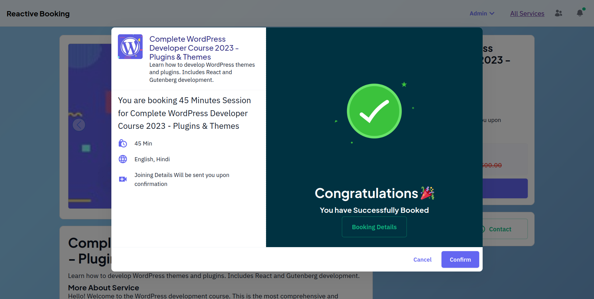
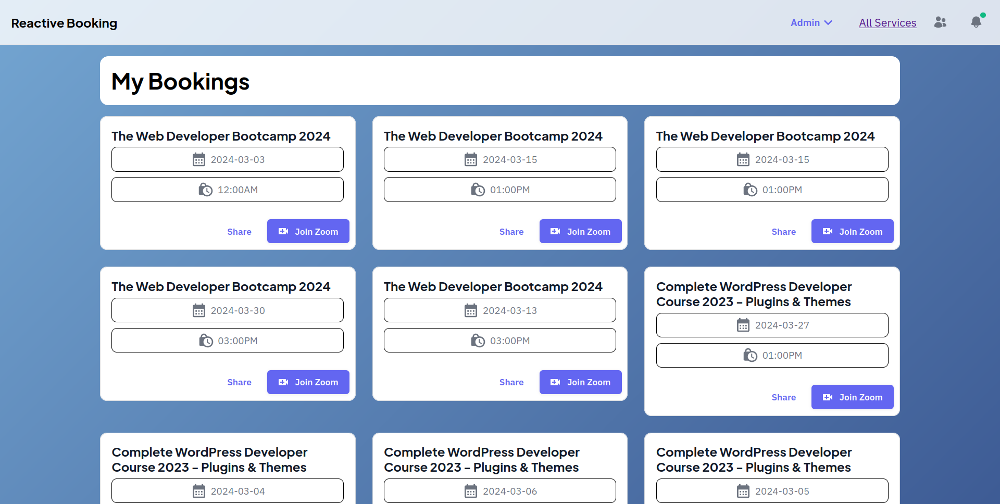
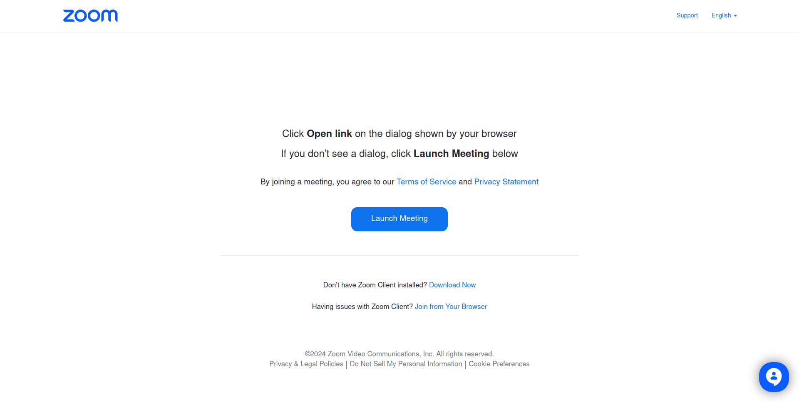
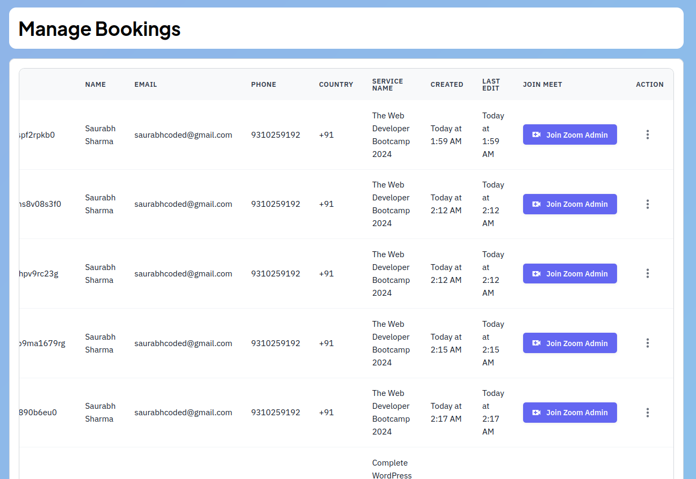
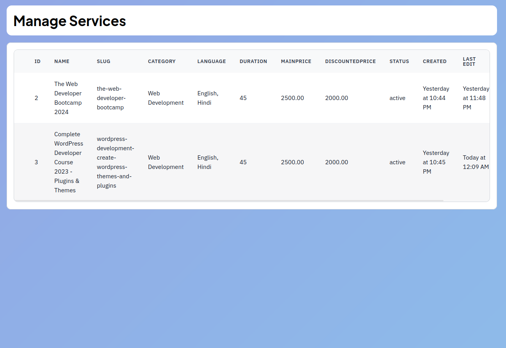

# Reactive Booking System

A powerful open-source booking management system developed with Laravel 10, MySQL, React, and Material UI.

API : https://documenter.getpostman.com/view/23944494/2sA2xb7GNi
## Features

- Seamless booking and reservation capabilities.
- User-friendly interface powered by React and Material UI.
- Database management with MySQL.
- Customizable and extendable Laravel framework.

## Requirements

Ensure your system meets the following requirements before installing the Reactive Booking System:

- PHP >= 7.4
- Laravel 10
- MySQL
- Node.js and NPM
- React
- Material UI

## Installation

1. **Clone the repository:**

   ```bash
   git clone https://github.com/saurabhcoded/ReactiveBookingApp.git
   ```

2. **Navigate to the project directory:**

   ```bash
   cd ReactiveBookingApp
   ```

3. **Install PHP dependencies:**

   ```bash
   composer update
   ```

4. **Install Node.js dependencies:**

   ```bash
   npm install
   ```

5. **Configure environment variables:** Duplicate the `.env.example` file and rename it to `.env`. Update the database and other relevant configuration settings.


6. **Compile assets:**

   ```bash
   npm run dev
   ```

7. **Start the Laravel development server:**

   ```bash
   php artisan serve
   ```

8. **Access the application:** Open your browser and visit `http://localhost:8000`.

## Demo Images

|  |  |  |
| ---------------------------- | --------------------------- | --------------------------- |
|   |  |  |
|   |  |  |

---
